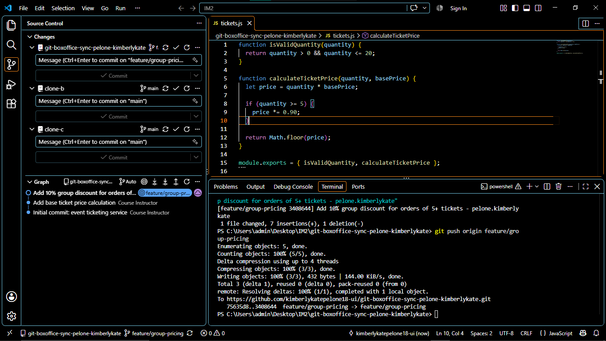
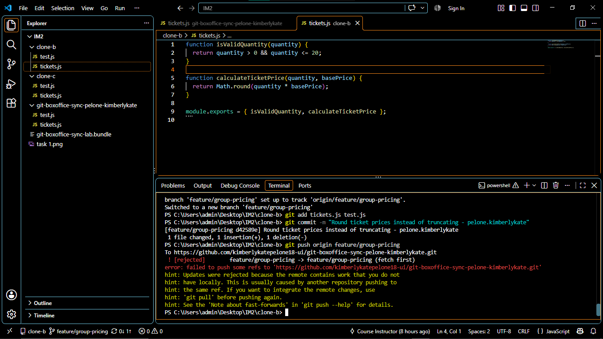
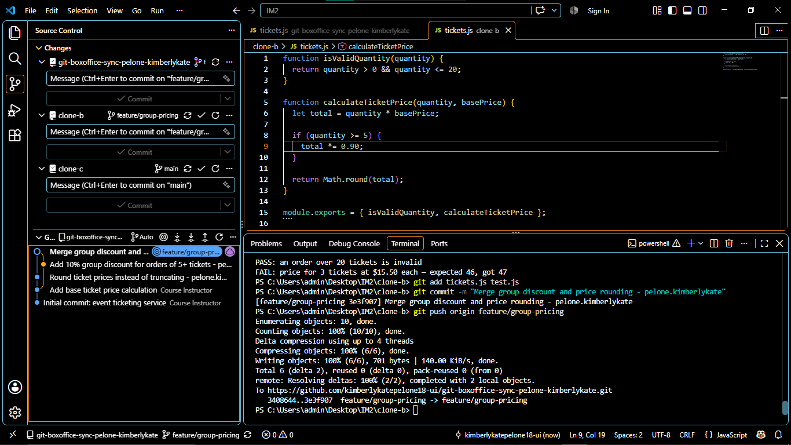
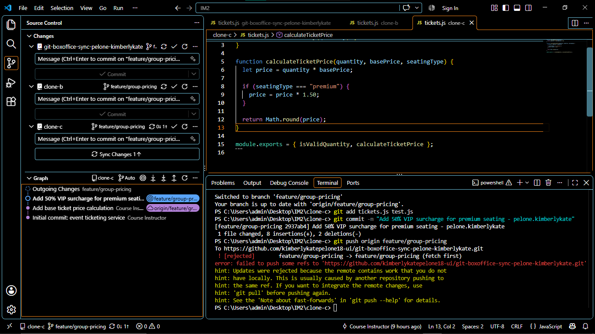
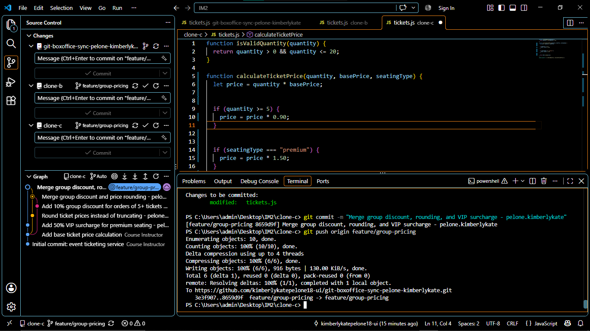
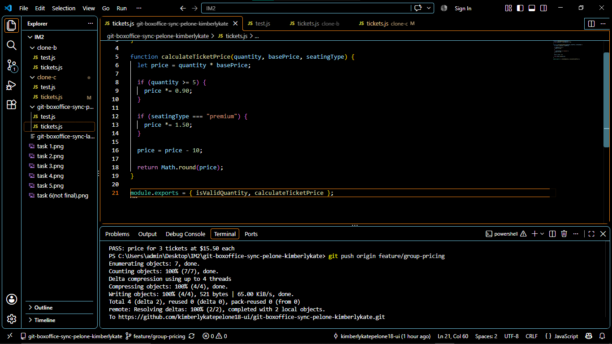
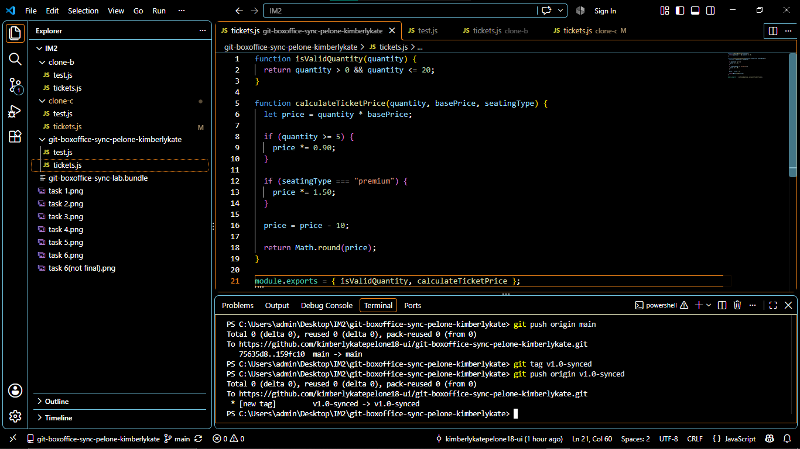

# WORKFLOW.md
 
## Task 1 — Group discount pushed from Clone A

 
## Task 2 — Diverging change in Clone B, rejected

 
## Task 3 — Merge resolution in Clone B

 
## Task 4 — VIP surcharge in Clone C, rejected

 
## Task 5 — Three-way merge resolution in Clone C

 
## Task 6 — Flat discount rejected, resolved via rebase

 
## Task 7 — Merged to main, tagged v1.0-synced

 
---
 
## Reflection Questions
 
### 1. Final `calculateTicketPrice` — who's responsible for what

The final calculateTicketPrice function combines the work of all three contributors. The calculation starts with the quantity multiplied by the base ticket price, which comes from the original starter code. The 10% discount for orders of five or more tickets was added by Contributor A in Clone A. The 50% surcharge for premium/VIP seating was added by Contributor C in Clone C. The rounding behavior was added by Contributor B in Clone B, changing the original truncation behavior to rounding. Finally, the flat $10 discount was added later in Clone A during the rebase task. The final function therefore contains all four changes instead of allowing one contributor's work to overwrite another's.
 
### 2. Task 3 (two-way conflict) vs Task 5 (three-way conflict) — what got harder

Task 3 involved two contributors changing the same part of the code, so the conflict only required reconciling the group discount with the rounding change. Task 5 was more difficult because a third contributor had made another change while their copy of the repository was older. The merge therefore had to account for three different lines of development at the same time. It was easier to accidentally remove or overwrite an earlier change, so I had to understand what each contributor intended and combine the behaviors manually instead of simply choosing one side of the conflict.
 
### 3. Why did the flat $10 discount change unrelated test results?

The flat $10 discount changed the final ticket price produced by the shared calculateTicketPrice function. Even though the new change was intended to be a separate discount, the group discount and VIP tests also use the same function, so their expected results were affected by the additional calculation. This shows that a change is not necessarily isolated just because it targets a different feature. When multiple features depend on the same shared function, changing that function can affect the behavior and tests of other features.
 
### 4. What one process change would have prevented all three rejected pushes?

A shared synchronization process would have prevented the rejected pushes. Before starting work, each contributor could fetch and update their branch from the latest remote version, and contributors could communicate which files or functions they were changing. A short pull/fetch and sync step before pushing would have made everyone aware of the latest branch history and reduced the chance of working from an outdated copy.